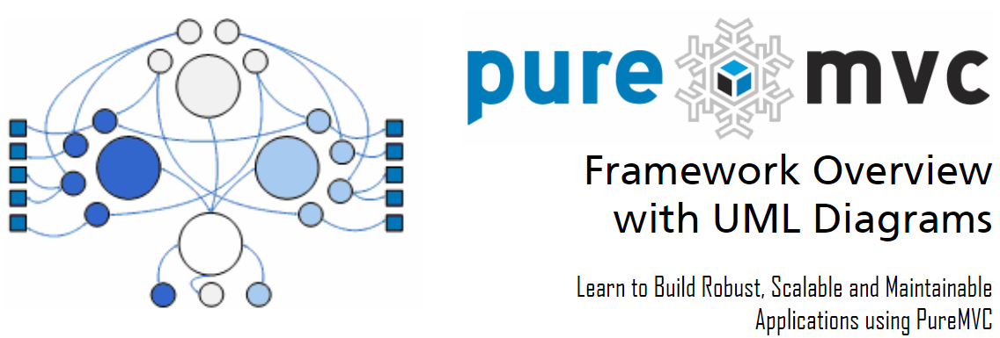

## Framework Overview
이 문서는 PureMVC 프레임워크의 클래스와 인터페이스를 이야기하며, 역할, 책임과 협력에 대해 간단한 UML 다이어그램으로 보여준다.

PureMVC 프레임워크는 애플리케이션을 모델, 뷰, 컨트롤러의 분리된 세 계층으로 분리하여 개발할 수 있게 하는 아주 좁은 목표를 가진다.

고전적인 MVC 메타-패턴의 구현에서, 애플리케이션의 계층은 세개의 싱글톤(단 하나의 인스턴스만 가지는 클래스)으로 표현된다.

네번째 싱글톤인 Facade는 애플리케이션 전반에 통신을 위한 단 하나의 인터페이스를 제공하여 개발을 단순하게 한다.

**Model**은 **Proxiy**의 참조 이름을 캐시한다. 프록시는 데이터 모델을 관리하기 위한 API를 노출한다(원격 서비스에서 조회한 데이터를 포함한다).

**View**는 **Mediator**의 참조 이름을 캐시한다. 메디에이터는 UI를 만드는 뷰 컴포넌트를 조정하고 관리한다.

**Controller**는 **Command** 클래스의 매핑 이름을 관리한다. 커맨드는 상태를 가지지 않으며, 필요시에만 생성된다.

**Facade**는 핵심 액터(Model, View, Controller)를 캐시하고 초기화한다. 그리고 그들의 모든 퍼블릭 메소드를 접근하기 위한 단일 인터페이스를 제공한다.

## Facade와 Core

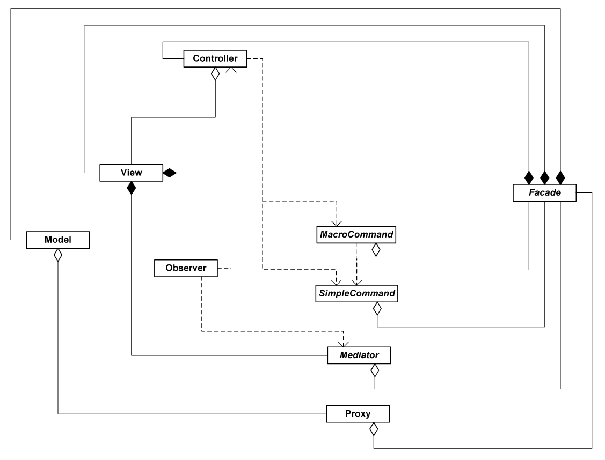

**Facade** 클래스는 Proxy, Mediator, Command가 약한 결합으로, 임포트나 핵심 프레임워크 액터 간 직접적 작업 없이, 서로 통신 가능하도록 한다.

Facade를 구현할 때, 상호 작용에 필요한 (아직 구현하지 않은)핵심 액터를 바로 사용할 수 있다. 프레임웍을 성공적으로 사용하기 위해 개발자에게 필요한 API 지식을 최소화한다.

Model, View, Controller 핵심 액터는 IModel, IView, IController 를 구현한다. Facade는 구성 별로 모든 핵심 인터페이스를 구현하는 IFacade를 구현한다.

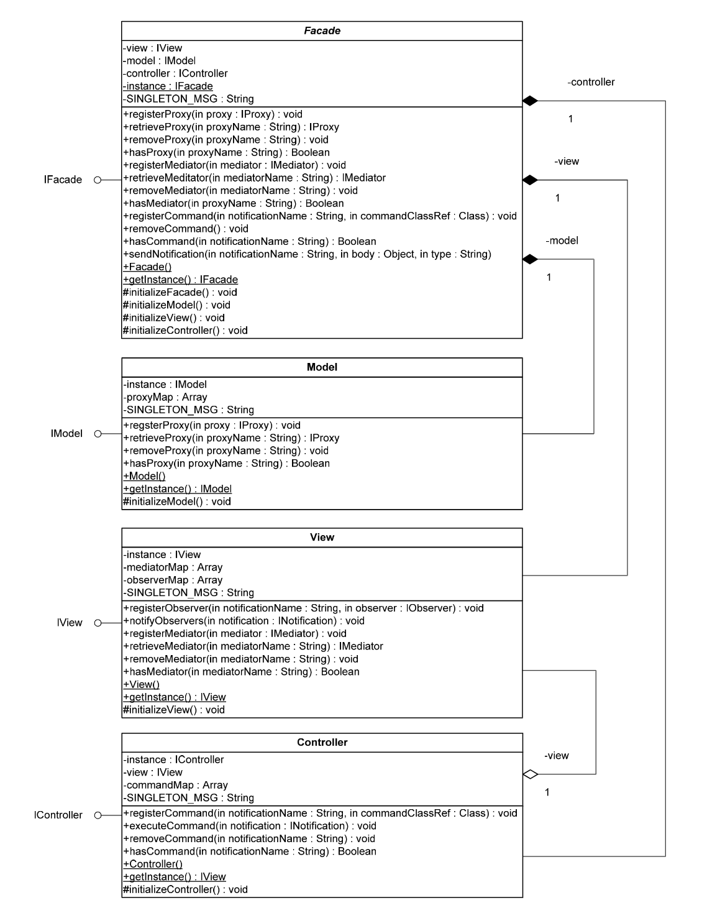

## View, Mediators와 View Component

View 클래스는 싱글톤으로 구현되며 IMediator의 구현체를 캐시하고 접근 방법을  제공한다.

**Mediator**는 **PureMVC** 애플리케이션이 서로 통신하는 법에 대한 지식없이 UI 컴포넌트를 생성하고 재사용할 수 있게 한다. **Mediator** 구현체는 **IMediator** 인터페이스를 구현하며, 보통은 프레임워크의 **Mediator** 클래스를 상속한다.

뷰 컴포넌트는 데이터를 표현하거나 사용자 제스쳐를 수용한다. 플래쉬 베이스의 애플리케이션은 **Mediator**와 일반적으로 **Event**로 통신하며 **Mediator**를 검사하고 관리하기 위한 일부 프로퍼티를 내 보인다. **Mediator**는 뷰 컴포넌트와 **Data**로 연결되지만, 대신에 시스템의 다른 것과는 **Event**로 통신한다.

**Mediator**을 **View**에 등록하면 관심있는 **Notification**으로 조회된다. 따라서 **Mediator**는 알림을 받기 원하는 모든 **Notification**의 이름을 **배열**로 반환야한다.

반드시 **IMediator** 인터페이스를 구현하기 때문에, 메디에이터 구현체는 **handleNotification** 메소드를 갖는다. **View**에 등록되면, **배열**안의 각 **Notification** 마다 **Observer** 객체가 생성되어 등록된다. 그래야 관심있는 **Notification**이 **Mediator**로 전송될 때마다 **Mediator**의 **handleNotification** 메소드가 호출된다.

**Mediator** 프레임워크 클래스는 INotifier를 구현하기 때문에  **sendNotification** 메소드를 가진다. 이 메소드는 파라메터를 받아서 새로운 **Notification**을 생성하고 **IFacade** 싱글톤 객체를 사용하여 보낸다.

**Mediator**의 protected **facade** 속성은 등록된 **IFacade** 객체로 초기화된다. 그러므로 **Mediator**는 반드시 애플리케이션의 **Facade** 구현체가 초기화된 후에 생성되어야 한다.

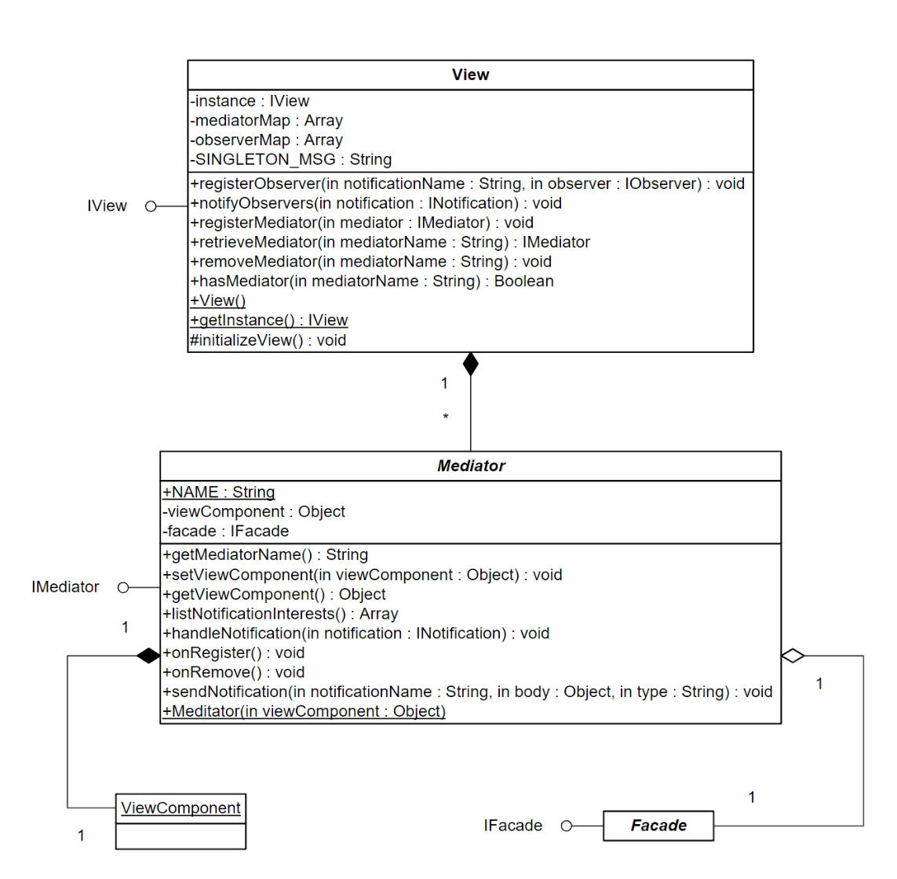

## Model, Proxy와 Data 오브젝트

**Model** 클래스는 싱글톤으로 구현되며 IProxy 구현 객체를 캐시하고 접근방법을 제공한다.

**Proxy**는 앤티티 클래스와 데이터 구조체(그리고 도메인 로직과 지원 서비스)를 어디서나 재사용할 수 있고, 나머지 애플리케이션에 미치는 영향을 최소화 하면면서 리팩토링할 수 있는 방식으로 애플리케이션에 노출하도록 도와준다.

**Proxy**를 사용하여 로컬 데이터 오브젝트의 참조를 간단하게 관리할 수 있다. 이 경우 상호작용을 위한 관용구는 동기 설정 및 데이터 가져오기가 필요할 수 있다.

**Proxy**는 원격 서버와 애플리케이션의 상호작용을 캡슐화하여 데이터를 저장하거나 조회할 수도 있다. 이 경우, **Proxy**를 통해 메소드를 호출하거나 데이터를 설정하고 **Proxy**가 서비스로부터 데이터를 조회할 때 전송되는 **Notification**을 기다릴 수 있다.

**Proxy** 프레임워크 클래스는 INotifier를 구현하기 때문에 **sendNotification** 메소드를 가진다. 이 메소드는 파라메터를 받아서 새로운 **Notification**을 생성하고 **IFacade** 싱글톤 객체를 사용하여 보낸다.

protected **facade** 속성은 등록된 **IFacade**객체로 초기화되므로 응용프로그램에 구체적 **Facade**가 초기화된 후에 **Proxy**를 생성해야 한다.

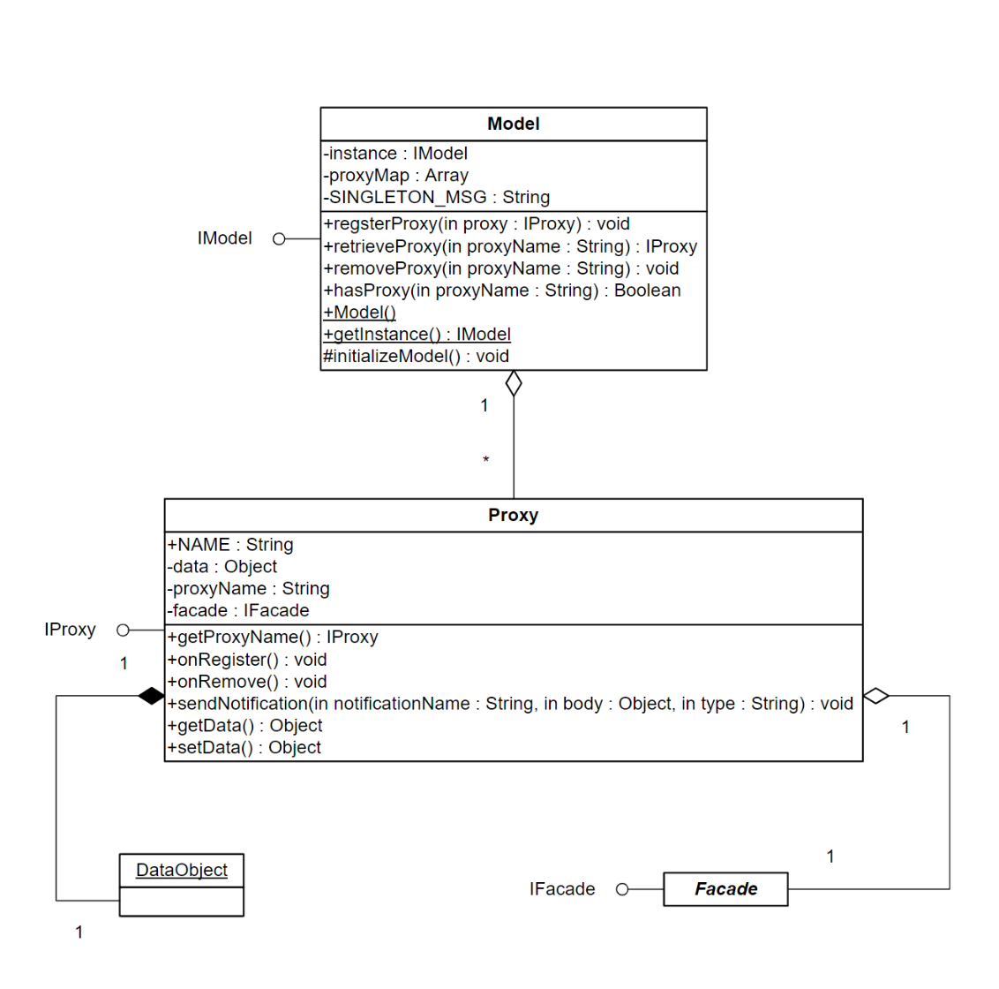

## Controller와 Command

**Controller** 클래스는 싱글톤으로 구현되며, **Notification**의 이름과 **Command** 클래스 참조 사이의 매핑을 관리한다.

**Command**는 **Proxy**를 조회하고 상호작용하며, **Mediator**와 통신을 하거나, 다른 **Command**를 실행한다. **Command**는 종종 복잡하거나 애플리케이션 시작 및 종료 같은 시스템 수준의 액티비티를 조율하는데 사용된다.

(일반적으로 **IFacade** 구현으로) 초기화 될 때, **Controller**는
**Notification**과 **Command**의 모든 매핑에 각각 적당한 **Observer** 객체를 생성하여 **View**에 등록한다. 등록된 **Notification**이 브로드 캐스트될 때, 그 **Notification**을 가지고 **Controller**의 **executeCommand** 메소드가 호출된다.

**View**가 **Notification**을 브로드 캐스트하면, **Controller**는 적당한 **Command** 클래스를 인스턴스화하고 **Notification**을 파라메터로 **execute** 메소드를 호출한다.

**PureMVC**에는 쉽게 확장할 수 있는 두 가지 **ICommand** 클래스 구현이 있다. 둘 모두 **INotifier**를 구현하므로 **sendNotification** 메소드를 가지며, protected **facade** 속성은 싱글톤 **IFacade** 인스턴스로 초기화된다.

**SimpleCommand** 클래스는 단지 **Notification** 객체를 파라메터로 호출되는 **execute** 메소드를 가진다.

**MacroCommand** 클래스로 여러개의 `subCommands`를 순서대로 실행할 수 있다. 각 subCommand를 생성하고 원래의 **Notification**를 파라메터로 **execute**를 호출한다.

**MacroCommand** 생성자에서 **initializeMacroCommand** 메소드를 호출한다. 따라서 `subCommand`를 추가하려면 하위 클래스에서 이 메소드를 오버라이드하여 각 **Command**를 파라메터로 **addSubCommand** 메소드를 호출한다. `subCommand`에는 **SimpleCommand** 뿐 아니라 **MacroCommand**도 추가할 수 있다.

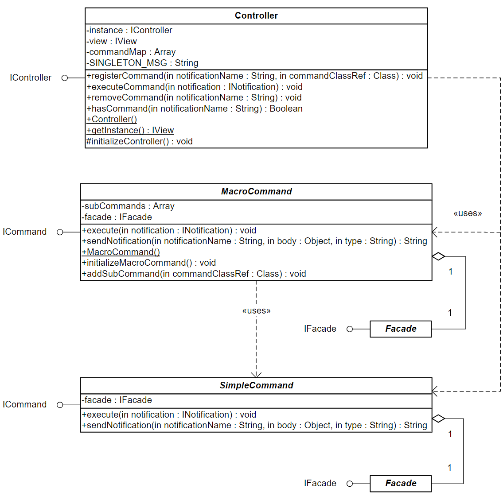

## View, Observer와 Notification

**Proxy**, **Mediator** 그리고 **Command**는 **Notification**을 브로드 캐스팅하여 느슨하게 결합되고 플랫폼 중립적인 방법으로 서로 통신한다.

  * Proxy는 Notification을 브로드 캐스트 할 수 있지만, 수신하지 않는다.
  * Mediator는 Notification을 수신하며, 브로드 캐스트 할 수도 있다.
  * Command는 Notification에 의해 트리거되며, 브로드 캐스트 할 수도 있다.

PureMVC 애플리케이션은 **flash.events.Event**와 **EventDispatcher** 클래스 없이 순수한 ActionScript 환경에서 운영할 수도 있기 때문에, 프레임워크는 코어 액터와 시스템의 다른 부분 간의 통신을 위해서 알림 감시 체계(Observer notification scheme)를 구현한다.

PureMVC는 이 목적을 위해서 Observer 패턴을 사용한다. **IObserver** 인스턴스는 알림을 받을 객체(*알림 콘텍스트*)의 참조와 **INotification**이 브로드 캐스트 될 때 호출할 해당 객체의 메소드(*알림 메소드*)를 전달한다.

**View**는 **Notification**의 이름과 **Observer** 목록의 맵을 관리하고 **Notification**이 전송될 때 모든 **Observer**에 알릴 책임이 있다.

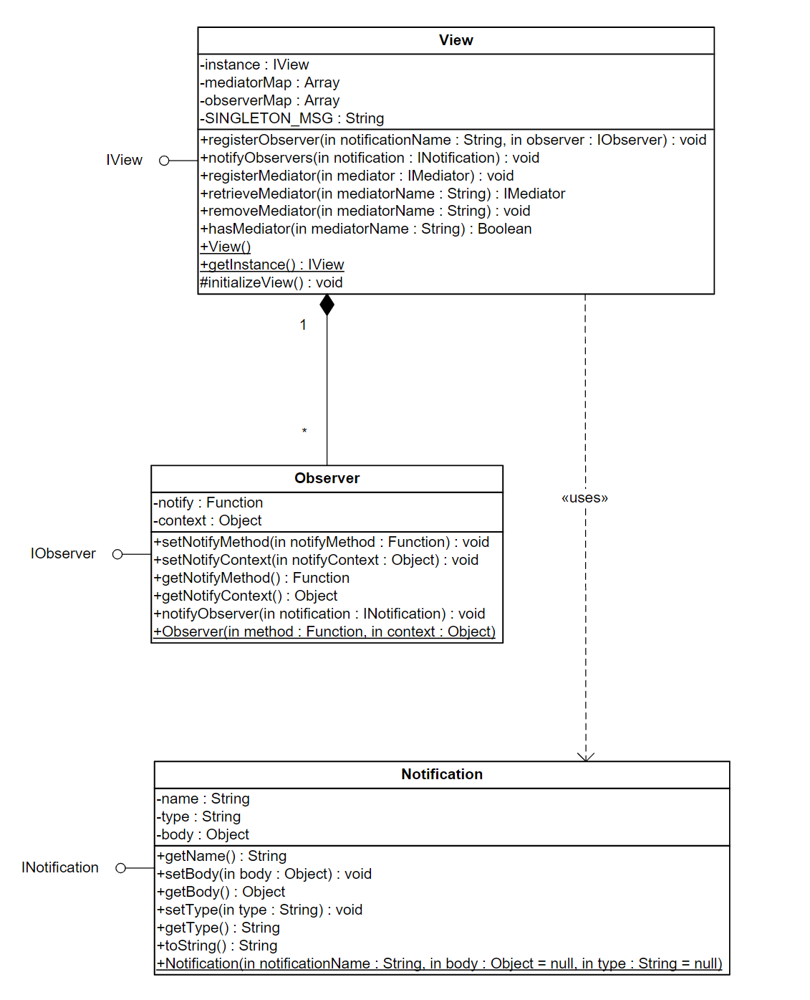

## Interface
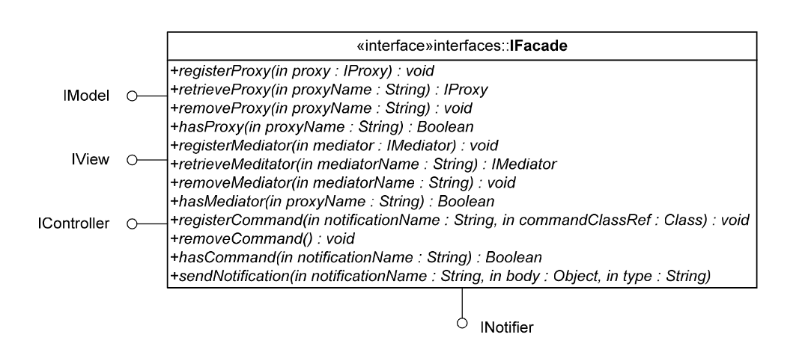

### IFacade

### IModel

### IView
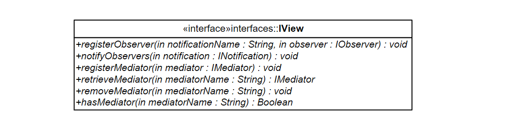

### IController
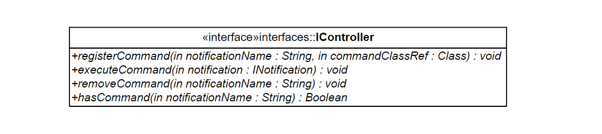

### IProxy
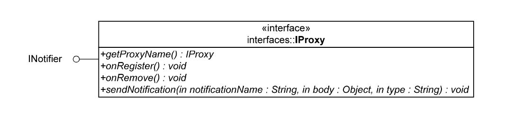

### IMediator
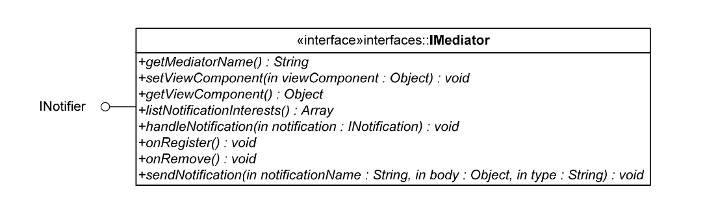

### ICommand
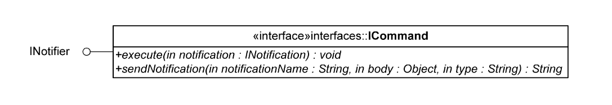

### INotifier
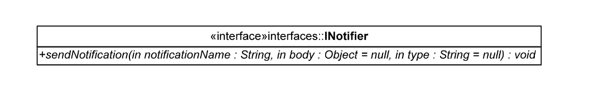

### IObserver

### INotification

